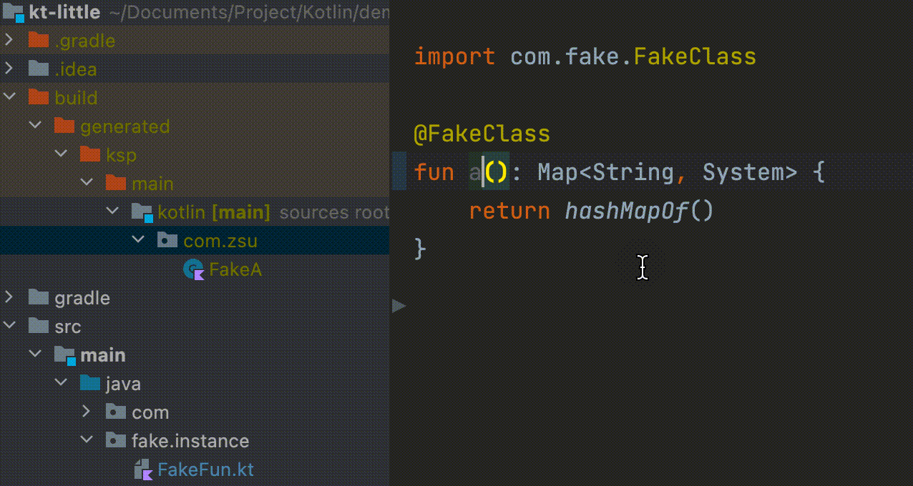

# Eden

No more wasted time waiting for kapt/ksp to generate classes for compilation!
Scan annotated elements and generating the classes we want to generate automatically, while
giving the IDE real-time hints!

再也不需要等待 kapt/ksp 生成类的编译浪费时间！使用 IDE 插件实时扫描带注解的类、方法、属性，并生成我们想生成的类，同时给予实时提示！

> Version 2.0 compared with version 1.0 is completely incapable, version 1.0: [README-1](README-1.md)
>
> Notice: 2.0 版本与 1.0 版本为完全不兼容改动，1.0 版本的 README: [README-1](README-1.md)

## Preview

It will generate files produced by the annotation processor in real-time when modifying elements containing specified
annotations.

它会在改动包含指定注解的元素的时候，实时生成注解处理器产生的文件



## Usage

### 1. Add Dependencies

maven-central release
version: [](https://central.sonatype.com/search?q=eden-idea)

```groovy
repositories {
    mavenCentral()
}
dependencies {
    implementation("io.github.zsqw123:eden-idea:$version")
}
```

### 2. Implement Annotation Processor

1. Define the annotations to be processed
2. Handling the `KtDeclaration` which annotated by the specified annotation.
3. Generate files in real-time

```kotlin
private const val FAKE_FQN = "com.fake.FakeClass" // the annotation full qualified name

class FakeApt : EdenApt() {
    override val annotationFqn: String = FAKE_FQN
    override fun processSingleModule(all: List<KtNamedDeclaration>): List<FileSpec> {
        return all.mapNotNull { it.name }.map { name ->
            val className = "Fake${name.capitalizeAsciiOnly()}"
            // generate codes by kotlinpoet
            val type = TypeSpec.classBuilder(className).build()
            FileSpec.builder("com.zsu", className).addType(type).build()
        }
    }
}
```

and register it in `plugin.xml`, don't forget include `Eden-plugin.xml`!

```xml
<idea-plugin xmlns:xi="http://www.w3.org/2001/XInclude">
    <xi:include href="/META-INF/Eden-plugin.xml"/>
    <extensions defaultExtensionNs="com.zsu.eden">
        <edenApt implementation="com.zsu.eden.sample.FakeApt"/>
    </extensions>
</idea-plugin>
```

## More

- For an example, see the `sample` module: [sample](/sample)

### Environment

| java | idea         |
|------|--------------|
| 11+  | 201.6858.69+ |

## License & References

[Apache License 2.0](./LICENCE)

This project uses the following open source projects：

- JetBrains IDEA
- JetBrains Kotlin
- Android IDEA Plugin
